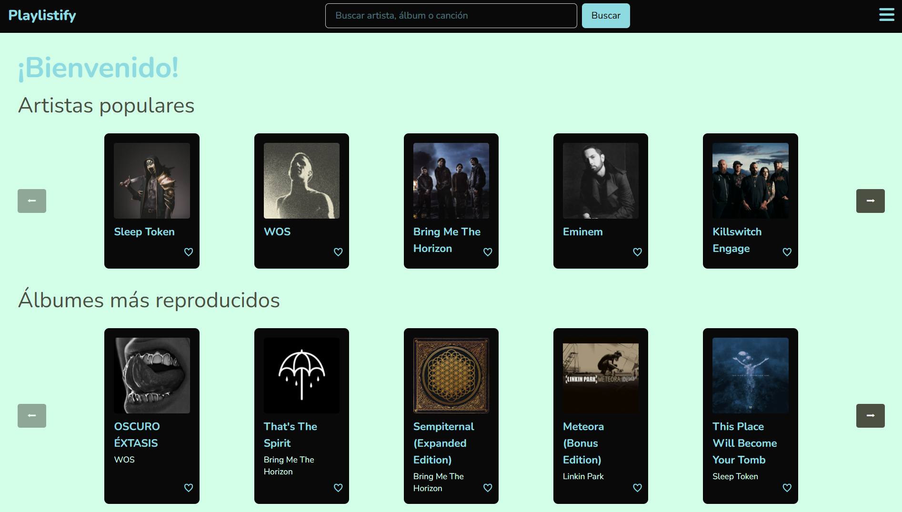

# Programación Web Avanzada 2025

<hr>

```javascript
const grupo20 = [
  {
    nombre: "Uñates Federico",
    legajo: "FAI-4988",
  },
  {
    nombre: "Emanuel Pinedo",
    legajo: "FAI-4871",
  },
  {
    nombre: "Rodrigo Martinez",
    legajo: "FAI-4318",
  },
];
```

  <hr>

# 🎵 Playlistfy

Una aplicación web para explorar música utilizando la API de Spotify, con funcionalidades de búsqueda, favoritos y detalles de artistas/álbumes.



<hr>

## 🌟 Características

- 🔍 Buscar artistas, álbumes y canciones
- ❤️ Guardar tus favoritos
- 📁 Organizar por artistas, álbumes o canciones
- 🌍 Soporte multiidioma
- 🎨 Diseño responsive

<hr>

## 🛠 Tecnologías

- React
- React Router
- Spotify Web API
- i18next
- Vite
- Tailwind CSS

<hr>

## 🚀 Instalación

### Pasos

1. Clonar el repositorio:

```bash
git clone https://github.com/FedeU18/playlistfy.git
cd playlistfy
```

2. Instalar dependencias:

```bash
npm install
```

3. Obtener credenciales:

- Registrate en https://developer.spotify.com/
- Ve a Dashboard y crea el proyecto "Playlistfy"
- Copia tu client_ID y tu client_secret

4. Crea un archivo .env en la raíz del proyecto y pega tus credenciales de la siguiente forma:

```env
VITE_CLIENT_ID = aquí iría tu client id
VITE_CLIENT_SECRET = aquí iría tu client secret
```

> **Importante:** nunca subas un archivo .env a tu repositorio.

5. Iniciar la aplicación:

```bash
npm run dev
```

<hr>

## 🔍 Uso

1. Página principal: Muestra artistas, álbumes y canciones populares

2. Detalles de álbum: Haz clic en cualquier álbum para ver sus canciones

3. Detalles de artista: Haz clic en cualquier artista para ver su información

4. Favoritos: Guarda tus artistas, álbumes y canciones favoritos

5. Búsqueda: Utiliza la función de búsqueda para encontrar música

<hr>
